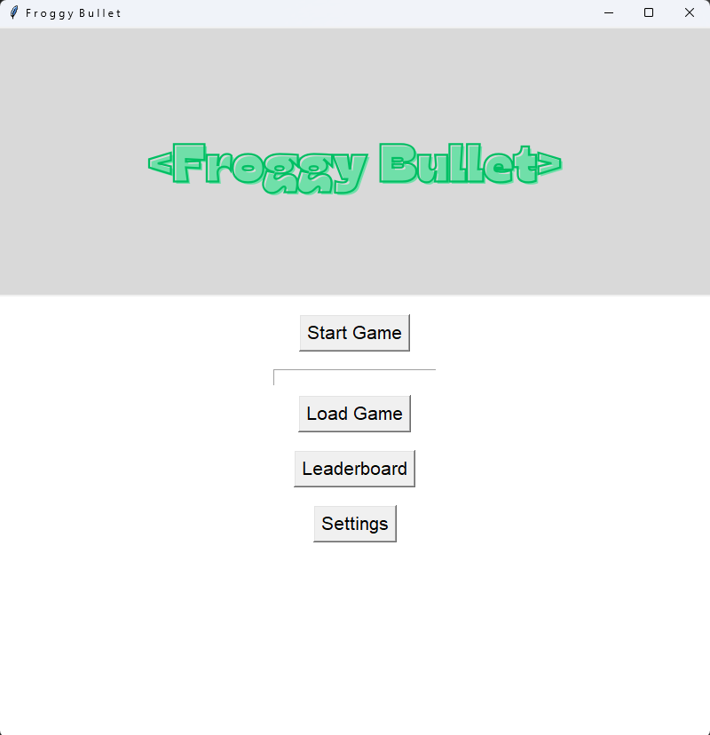
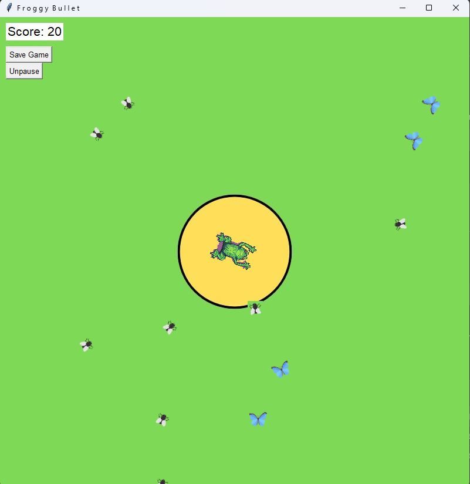
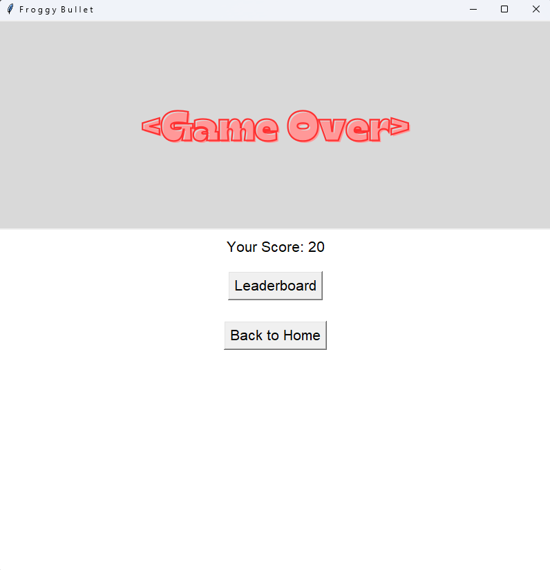

# Froggy Bullet 🐸🎯
*A fast-paced shooting game where you play as a frog battling against bugs, butterflies, and bats! Rotate, aim, and fire to defend your pond.*

## Introduction
Froggy Bullet is an interactive game built with Python's Tkinter library. In this game, you control a frog, rotate it to aim, and fire its tongue to eliminate enemies. The game challenges your reflexes and strategy as you progress, introducing faster and tougher enemies like bats. Includes cheat codes, a save/load feature, leaderboard, and a boss key to mask gameplay when needed.

## Features
Interactive home screen with options for starting, loading, and customizing gameplay.
Shooting mechanics with realistic rotation and aiming.
Various enemies: bugs, butterflies, and bats, each with unique behaviors.
Cheat codes to make gameplay more fun.
A boss key to quickly hide the game when necessary.
Save/load functionality for resuming gameplay.

## How to Play
1. Objective: Use the frog to shoot enemies before they reach your pond.
2. Controls:
    - Arrow keys (or assigned buttons): Rotate the frog left/right.
    - Spacebar (or assigned button): Fire the frog’s tongue to attack enemies.
    - Ctrl + C: Input cheat codes.
    - Ctrl + B: Activate the boss key to hide gameplay.
3. Cheat Codes:
    - vanish: Removes all enemies.
    - snail: Slows enemies for 10 seconds.
    - oman: Adds 100 points to your score.

## Screenshots

### Home Screen

### Gameplay Screen

### Settings Screen

## References

1. [Butterfly Image](https://www.flaticon.com/free-icon/butterfly_408057?term=butterfly&page=2&position=9&origin=search&related_id=408057)
2. [Fly Image](https://www.flaticon.com/free-icon/fly_9421093?term=fly&page=1&position=27&origin=search&related_id=9421093)
3. [Bat Image](https://www.flaticon.com/free-icon/bat_8625588?term=bat&page=1&position=76&origin=search&related_id=8625588)
4. [Frog Image](https://pixel-prismor.itch.io/colorful-frogs)
5. [Butterfly2 Image](https://www.flaticon.com/free-icon/butterfly_628300?term=butterfly&page=1&position=12&origin=search&related_id=628300)
6. [Butterfly3 Image](https://www.flaticon.com/free-icon/butterfly_2281191?term=butterfly&page=1&position=60&origin=search&related_id=2281191)